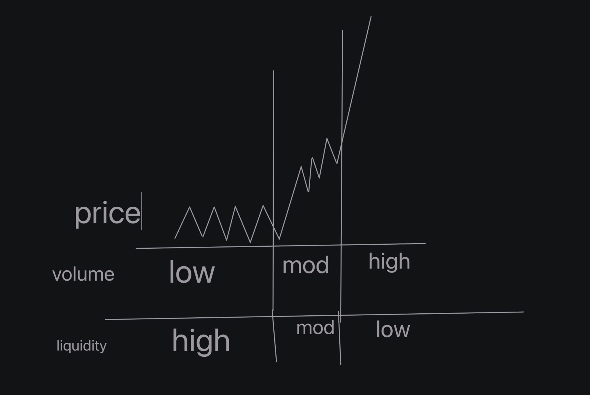

Market microstructure studies the inner-workings of financial markets:
- how markets operate
- how prices are formed
- how traders behave
- how exchanges are structured

When I attempt to trade on any exchange (could be stocks, crypto, etc), even though the trade is executed in a few seconds, there actually is a counterparty to that trade.
What this means is -  assuming I placed a buy stop order for USDJPY, and the order got filled, then there was a seller that matched my buy request. This is the case for either a buy or sell.
This counterparty could be a trader, an algorithm, an institution or a market maker.

The job of the market makers, as against what's commoonly touted, is toe stay delta neutral, and capture the spread betweek bid and ask -  where delta refers to the directional bias towards the underlying asset.

What moves the markets?

Markets are moved based on supply and demand dynamics, when buyers ane sellers agree on fair prices, the markets are in equilibrum - i.e they range.
When there is an imbalance between supply and demand, markets trend.

Terms worth noting:
Liquidity: 
This refers to the number of orders resting in the order book.

Volume:
This metric is a measure of how many orders in the orderbook got executed.

Volatility is said to be a function of liquidity, in that less-liquiid markets are much easier to move than markets with well-populated order books.

As a function of their available volume and liquidity, markets can be categorized into four groups.

1. Markets with High Volume & Low Liquidity

In these type of markets, there is a high level of aggression, i.e there are more market orders being placed, than resting orders in the order books, to take the counter side of the trade. e.g more buy stop orders than there are matching sell stop orders.
This situation leads to thin market moves, represented by PRICE GAPS, leading to slippage for traders.

2. Markets with Low Volume & High Liquidity
This phenomenon often occurs in very thick markets. In this scenario, there are a lot of resting orders in the orderbook which requires much market orders (buying and selling) in order for the market to move either way. This results in proloonged market movement and low volatility.

3. Marekts with High Volume & High Liquidity
4. Markets with Low Volume & Low Liquidity
In these cases, there are equal amounts of resting orders as there are market orders, resulting, which are matched equally, resulting in a "normal" market behavior.

The image below attempts to visualize these categories

### Understanding Market Movements

As explained in [this video by Young Tilopa](https://www.youtube.com/watch?v=VSMGHumsMik), there are two main phenomena that explains why markets move.

1. Herding

Also known as herd mentality, this is a concept in human psychology concept in which  people tend to react in a particular way to the same information, especially because they see others react in that same manner.
For instance, if there is fundamental news about a given traded asset, it is set to evoke the same set of reactions from traders, because they are looking at the same charts.

While herding is a known factor in market movements, it is only the minor of the two reasons.

2. Order Splitting

Order splittting is the major factor that influences market movement.

When large traders (insitutions, hedge funds, etc) enter a position in the market, they do not do so in one fell swoop, but in smaller chunks. This is because:
- Placing a market order for a very huge amount that could move the price of the underlying asset places them at the risk of not having their order filled, hence slippage
- Placing a limit order exposes too much information in the order book, putting them at the risk of being front-runned.

Hence order splitting, which results in multiple trades placed by same entity, with same objective in mind, causing the market to move in that direction.

A good way to tell the potential direction is by studying the asset's [volume profile](https://tradingriot.com/volume-profile).

