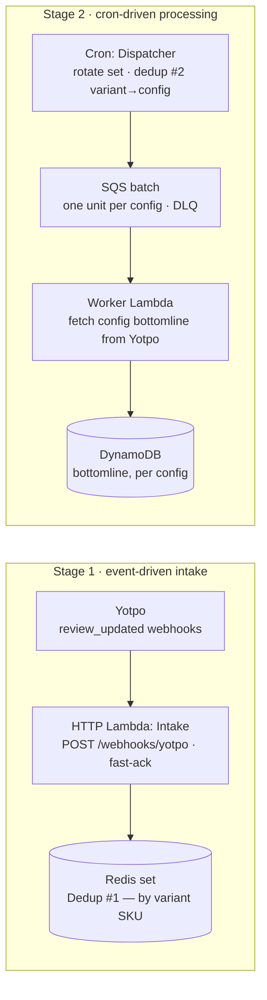

# Behind the Stars

### Building the review ingestion pipeline before there was an API to serve it

> **Draft v1** · by Osifo Anosike · ~10 min read · Lambda · SQS · DynamoDB · Redis · Yotpo

> **What this covers:** everything that gets review data *in* and keeps it *current* — webhook registration, intake, async processing, persistence, and the aggregation cron. The read endpoint `GET /reviews/{store}/{sku}` and its edge caching come in a follow-up; here we're filling the tank, not opening the tap.

**By the numbers** *(fill in with real figures)*

| Metric | Value |
|---|---|
| Webhook events at peak | `‹peak/min›` |
| Intake ack latency (p99) | `‹p99 ms›` |
| Stores served | `‹stores›` |
| Cost per million events | `‹$ / M›` |

---

You can't serve reviews you don't have. Long before there was an endpoint returning star ratings on a product page, something had to pull review data out of a rate-limited third party, process it without dropping events under load, persist it, and keep aggregate scores fresh on a schedule. That "something" is the ingestion pipeline — and it's where nearly all the architectural decisions actually live.

This post walks through that pipeline as it was built, told by following a single review update from the moment it arrives to the moment its aggregate score is recomputed.

## The ingestion backbone

*Redis also caches Yotpo auth tokens, shared by every runtime. `POST /webhooks/register` provisions the Yotpo subscriptions per store.*

## 01 · The problem, and why it's not trivial

Reviews are read-heavy and conversion-critical, but the source of truth — Yotpo — is a rate-limited external API we don't control. The whole design tension is right there: we want fast, always-available reads on top of a slow, fallible dependency. That's only possible if review data already lives in *our* store, kept current by a pipeline that can survive Yotpo being slow, throttling us, or delivering bursts of webhooks all at once.

The asymmetry drives everything: a review is written rarely and read constantly. So the design optimizes the write path for **durability and recoverability** — never lose an update, always be able to replay it — and leaves latency optimization to the read path downstream.

## 02 · The backbone at a glance

Three Lambda runtimes share one codebase. An **HTTP** runtime receives webhooks and admin calls; a **worker** runtime drains an SQS queue; a **cron** runtime runs the scheduled aggregation. They're composed per-entry-point with dependency injection — one deploy and one source of truth for the domain logic, rather than three services that drift out of sync. Redis caches Yotpo auth tokens across all of them, and DynamoDB is the durable store. The diagram above is the whole system in one glance — everything below is a zoom into one stage.

## 03 · Bootstrapping the integration: webhook registration

Before a single event can arrive, each store has to be wired up on Yotpo's side. `POST /webhooks/register` takes a `shoplist` and, per store, fetches an auth token, then creates a webhook subscription — a filter plus a target — so Yotpo knows to deliver `review_updated` events to us.

> **Why push, not poll.** Polling Yotpo on a schedule would burn our rate-limit budget and add minutes of staleness for a signal that changes unpredictably. Webhooks trade that for a reliability problem — deliveries can be lost or duplicated — which we solve downstream with the queue and idempotency rather than upstream with polling.

Two decisions matter here. First, **idempotency**: stores that already have an active subscription are rejected rather than duplicated, so re-running registration is safe. Second, **partial success**: registering three stores where one fails returns a per-store breakdown of what succeeded and what didn't, rather than an all-or-nothing 500. The overall call succeeds if *at least one* store registered — because a transactional rollback across an external system we don't own is a fiction, and an operator would rather see "two of three worked, here's the third" than a bare failure.

## 04 · Webhook intake

Once subscriptions exist, events flow to `POST /webhooks/yotpo`. The intake handler does as little as possible: validate the envelope, decide whether the event matters, record it, and acknowledge fast. Yotpo expects a prompt 200 — anything slow risks redelivery — so intake never does the heavy lifting inline.

Events flagged `archived`, `deleted`, or `new` are acknowledged but dropped; they don't change the aggregate we serve. A meaningful event contributes its **variant SKU to a Redis set** — and because it's a set, that *is* the first line of deduplication: ten reviews landing on the same variant collapse to a single entry to be dealt with later. Intake never talks to DynamoDB or Yotpo; it just records what changed and returns.

## 05 · The processing cycle: cron, a second dedup, and fan-out

Intake only accumulates *which* variants changed. The real work is driven by the **cron** runtime on a weekday schedule (`handlers/taskDispatcher.ts`). When it fires, it atomically rotates the intake set into a processing set and runs a **second level of deduplication** — this time collapsing variants up to their *product config*, the parent that groups a family of variant SKUs.

That second dedup is the crux of the design. Yotpo aggregates review data at the config level, and DynamoDB stores the bottomline at the config level — so we don't need every changed variant, we need *one representative variant per config*. A config with fifty changed variants becomes a single unit of work carrying one variant to speak for it. Dozens of raw webhooks collapse into one Yotpo call per affected config.

Those per-config units are fanned out as an **SQS batch**. A worker drains the queue, uses the representative variant to fetch the config's bottomline from Yotpo, and writes it to DynamoDB. Anything that fails past its receive limit lands in a DLQ to be inspected and replayed.

> **Why fan out over SQS, not one long cron invocation.** A single Lambda looping over every config would press against the 15-minute ceiling and let one bad config poison the whole run. Fanning the deduplicated units onto SQS makes each independently retryable, with a DLQ and natural back-pressure. And SQS specifically — not Kinesis (we don't need ordered, replayable streams; units are independent) or EventBridge (one consumer, not content-based fan-out) — because a durable buffer with a DLQ at the lowest operational cost is exactly the fit.

## 06 · Delivery semantics & idempotency

This is what makes the pipeline trustworthy. Yotpo delivers webhooks **at-least-once** — a timeout or non-200 triggers redelivery — and SQS is at-least-once too. End to end, the same review update *will* be seen more than once, and the system has to shrug that off.

Two layers of deduplication do exactly that. At intake, duplicate deliveries for a variant collapse into the Redis **set**. At cron time, variants collapse again into **one entry per config**. By the time anything reaches Yotpo or DynamoDB, a storm of redelivered, overlapping webhooks has become one recompute per affected config — double-counting simply isn't representable.

> **Why ordering doesn't matter here.** SQS standard queues don't guarantee order, and we don't need them to: units are deduplicated by config, and each config's bottomline is recomputed from Yotpo's *current* aggregate rather than derived incrementally from individual events. Duplicate or out-of-order delivery converges to the same answer — which is what lets us use the cheaper, higher-throughput standard queue instead of FIFO.

## 07 · Persistence & the data model

Two things live in **DynamoDB**: the variant→config mapping the cron uses to roll variants up to their parent, and the bottomline itself — total reviews and average score — stored *per config*, matching the granularity Yotpo aggregates at. Review *content* isn't stored in this phase at all; it's fetched from Yotpo on the read path and cached.

Processing state lives separately, in Redis: the intake set, the rotated processing set, and a per-store metadata record marking each store's cycle `processing` or `completed` (the cycle finalizes only once every active store is done). Keeping that operational bookkeeping out of DynamoDB means the durable store holds only durable facts.

> **Why DynamoDB, not a relational store.** The access pattern is known and narrow — look up a config by store and key — so we don't need joins or ad-hoc queries. DynamoDB gives single-digit-millisecond reads for the future read path, scales with Lambda concurrency without a connection pool to exhaust, and bills per request rather than per idle instance. A relational DB would add connection management in Lambda and buy flexibility we don't use.

### The spine — trace one review update

1. Yotpo POSTs a `review_updated` event to `/webhooks/yotpo`.
2. Intake drops it if `archived/deleted/new`; otherwise it adds the variant SKU to a Redis set (duplicates for that variant collapse) and returns 200.
3. On its schedule, the cron rotates the set and dedups variants up to their product config — one representative variant per config.
4. Each config unit is fanned out over SQS; a worker fetches that config's bottomline from Yotpo using the representative variant.
5. The bottomline is written to DynamoDB at config level; per-store Redis metadata marks the cycle complete once every active store is done.

## 08 · Resilience, blast radius & graceful degradation

Yotpo shows up everywhere, so resilience is centralized. Auth tokens are cached in Redis so we're not re-authenticating on every call; requests retry with backoff; and failures are wrapped in a `DomainError` taxonomy that turns a messy upstream error into a uniform response envelope carrying a correlation id.

**The blast radius is deliberately small.** Because reads are served from our own store, a stalled pipeline — Yotpo down, or the worker failing — degrades to *slightly stale reviews on the storefront*, not an outage. Ingestion lag is decoupled from user-facing availability. SQS provides the back-pressure so a delivery burst queues instead of cascading into downstream failures, and sustained failure surfaces as rising DLQ depth on an alarm rather than a customer-visible incident. A bad hour at Yotpo costs freshness, not uptime.

## 09 · Observability across async hops

The hard part of observing this system is that a single logical operation crosses process boundaries — HTTP, then SQS, then a worker. A **correlation id** is generated at intake and propagated *through the queue message* so one webhook can be traced all the way to its DynamoDB write and bottomline update. Without that propagation, the trace would dead-end at the queue and the async half of the system would be a black box. Structured logs and New Relic round it out; the metrics that actually matter are event throughput, Yotpo error rate, and DLQ depth.

## 10 · Deep dive: moving a live Redis between Terraform states

The pipeline's dependencies — the queue, Redis, the worker and cron Lambdas with their security group, the SSM parameters — are all provisioned with Terragrunt on top of a shared application-infrastructure module. The sharpest problem there wasn't creating anything — it was **changing ownership** of a Redis cluster that already existed and was already serving traffic. It had been provisioned by a neighbouring Terraform unit, and this service needed to own it going forward. The cluster was live; destroying it wasn't on the table.

### The options, and why most were wrong

Three paths presented themselves. **Destroy and recreate** under the new owner: simplest to express in config, but it means downtime and a cold cache — a non-starter for a live dependency. **Rename it** in the new unit's config and hope it attaches: this is the trap — the name *is* the identity, so a rename doesn't re-point at the existing cluster, it plans a brand-new one alongside the old. **Migrate the state**: move the resource's state entry from the old unit to the new one so Terraform's model of the world changes while the real cluster never moves.

### How the migration actually worked

State migration was the only option that preserved the running cluster. The resource entries were moved from the source unit's state into this service's state, so that a subsequent `plan` showed *no changes* — the definition of a clean takeover. The gotchas were real: a generated `random_id` resource had to move intact or the downstream names would churn; a stale state lock from an interrupted run had to be released first; and every step was gated on a plan that must show zero destroys before applying.

> **The lesson.** Ownership of a resource is a property of Terraform *state*, not of the name in config. Renaming changes identity and creates; migrating state changes bookkeeping and preserves. Getting that distinction wrong is how teams accidentally destroy live infrastructure during a "harmless" refactor.

## 11 · What's next: opening the tap

With the tank full — reviews flowing in, processed idempotently, persisted, and aggregated — the read side becomes almost easy: a thin endpoint over data that already lives in our store, wrapped in layered caching. That's the follow-up. The lesson of this phase is that the interesting engineering was never in returning the data; it was in reliably getting it there, and being able to prove nothing was lost or double-counted along the way.
